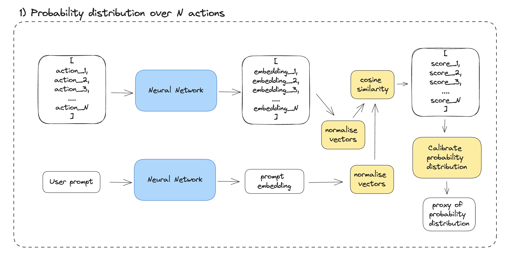

# User Intent resolution via maximal entropy minimisation

Note: Current implementation in the `main.py` involves the simples solution to each module below i could think of. The solution i envisioned consists of more complex modules and I will be updating them itteratively.

## Objective

Given a prompt to an AI agent, "Can you contact Mike?" the action the agent should take—"contact via email" or "contact via WhatsApp"—is unclear. Such a user prompt contains an insufficient amount of information to allow system to discriminate between these two actions, resulting in ambiguity. To achieve a high level of accuracy, the machine needs to seek additional information before making a decision. Asking the user for clarification is a clear and often the best way to reduce this uncertainty. The figure below provides a general schematic of how this can be achieved. It takes the form of a clarification loop, where the performance objective is to disambiguate the mapping from user intent to a single action in as few loop iterations as possible (following the belief that fewer steps mean a lower cognitive load and thus a better user experience).

In the following sections, we will introduce and explore ideas on how each of these four steps of the clarification loop can be implemented.


## Motivation

> Why not just perform a single step LLM prompt, where both intent and actions are added to the prompt context?

- This may work with 100 or 1000 actions, but what when we have +10,000 actions or +100,000 actions? Will LLM be aware about all ambiguities between intent and the set of actions? Can we trust that the structure for modelling probability of mapping `intent -> action` will happen implicitly?
- How much trust do we have in LLMs performance? Can we introduce enough inductive bias about selection process into the prompt to warrant enough clarifyign questions to achieve X% confidence that the final proposed action is the right match for users intent?
- What when the set of actions is not an unstructured list, but comes as a tree or a graph? (i.e. DOM of a website). Should we flatten the tree for inference with LLM? or conduct action inference at every page of the DOM tree? Wouldn't search through the tree be more optimal?
- Cost. Searching a datastructure of embeddings with a cheap embedding model is almost free, while cost of LLM inference scales linearly with number of actions in the set.

## 1. Probability distribution over N actions

Number of actions `N` is unknown apriori for a general system. Thus a solution needs to be able to accomodate varying `N`number (a simple classification over N actions with calibrated logits deosn't satisfy this requirement). A potential solution could involve a contrastive learning (or metric learning) between `intent` and `action` where the labels are generated in a binary fashion `can this intent be fulfiled with a given action?`. In principle, the more suitable the action, the smaller the cosine distance between its embedding and that of the user's prompt. Out of the shelf embedding models, trained to generate semantic latent representation of language, can be used as well, however this will be limited by the amount of noise introduced by semantic similarities between words and sentences, which is not equivalent to the original question `can this action fulfil user's request?`. Contrastive learning where we evaluate score for one action at a time has also the limitation that it misses out on the information of the context of other avialbale actions in the set - we believe this will only have a minor effect.



Assumptions:

- we assume thatthere is a finite set of N actions the system can perform.
- there is at least one action that satisfies user's intent.

## 2. Is the intent -> action mapping clear?

Given a probability distribution over a set of actions, we want to take a binary decision as to whether to take an action or ask a claryfing question. If we perform the most likely action, the expected error rate will be `1 - max( p(action|intent) )` - so the answer to our binary question is then a matter of our sensitivity to the error rate, a hyperparameter. Thsi hyperparameter governs the tradeoff between accuracy and the number of claryfing questions represented by the figure below.


If we select a single hyperparameter probability threshold `thr` for `max( p(action|intent) )` there are a few points worth keeping in mind:

- The longer the list of actions, the more loop steps (claryfing questions) it will take to achieve `thr`
- Is `max( p(action|intent) )` a good metric to guide the binary decision? Should we use entropy instead?
  - `max( p(action|intent) )` makes sense because we care about selecting the most likely answer.
  - if `thr` is sufficiently high i.e. `> 0.8` as opposed to `> 0.5` we don't need to worry about two actions having high probability, as `thr >> 0.5` ensures that the best second action has probability `<< 0.5` (where `<<` means _much_ lower than).

The above, however, requires the model that generates the probability distribution from the first step to actually model the question `Can this action fulfil the intent?`. However this may not be fully possible (i.e. if we don't train specifically for this task).

## 3. Claryfing question

When asking a claryfing question, what question should we ask? Since the objective is to find `argmax_i( p(action|intent) )` where `thr < p(action_i|intent)` in as few steps as possible, the claryfing question should aim to achieve this objective. To achieve this, we can aim to mnimise `entropy` of a distribution[^1]. How can we achieve this?

We could provide a set of actions and the user's intent to an LLM and prompt it to select the right claryfing question. When listing actions in prompt's context, we could provide our computed probabilities to explicitly point to the LLM where the ambiguity lies (and thus simplify the task for the LLM, without requiring it to implicitly model the entropy). This approach however, requires us to enter all actions into the context of a prompt, which doesn't allign with the motivations we stated in the motivation section at the begining of this document.

Alternative options:

- we could filter only top `K` actions, with the highest probability, and ask LLM to provide a claryfing question to disambiguate only those.
- we could itterate over the set of actions and remove those which clearly don't apply as they contradict the intent or don't fulfil some requirements already expliclty mentioned. These would leave us with only plausible options which we still can't discriminate from.

[^1]: I am still not 100% clear on this, but mnimising entropy is not the same as trying to maximise `max( p(action | intent) )`. In the former we try to minimise probability of irrelevant actions and maxmise probability of relevant action, while in the later, we only try to maximise probability of the relevant action, which doesn't require us disambiguating actions with lower probability. Although, they seem pretty much related so it doesn;t seem like an important question to delve upon.

## 4. Update user prompt

This is best done with a simple LLM prompt

```
Here is my original request: {intent}
Here is the follow up question you asked: {question}
Here is my answer: {answer}

Can you integrate my answer into my original request which would make the claryfing question unnecesary?
Output just the modified original request. New original request:
```

## An example of the system

#### 0. Users intent and set of actions

```
intent = "I want to contact Mike"
actions = [
    "Open a new document in Microsoft Word",
    "Browse the latest news on a news website",
    ...
    "Send an email",  # relevant action
    "Send a message"  # relevant action
]
```

#### 1. Generate probability dsitribution

Only "send an email" and "send a message" are plausible, around 50% each. All other options are not fulfiling the request.

#### 2. Is the intent -> action mapping clear?

No.

#### 3. Claryfing question

System: "Do yuou want to contact Mike via email or message?"
Answer: "email"

#### 4. Update user prompt

Old prompt: "I want to contact Mike"
New prompt: "I want to contact Mike via email"

##### End

On another pass, thorugh the loop the mapping is clear
Returned action: `"Send an email"`
